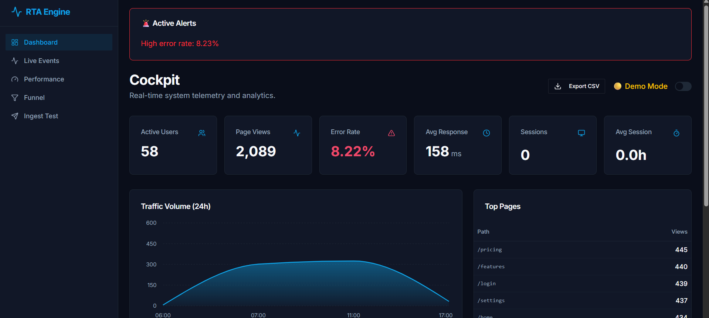
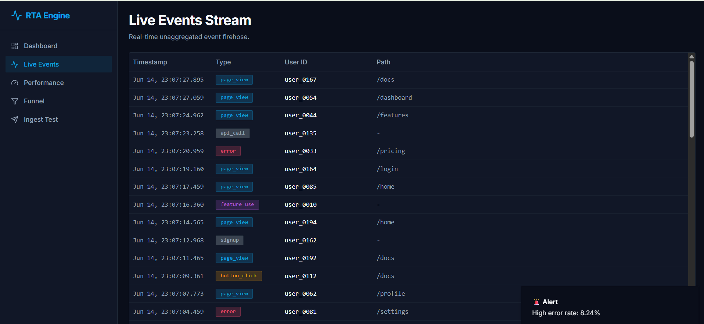
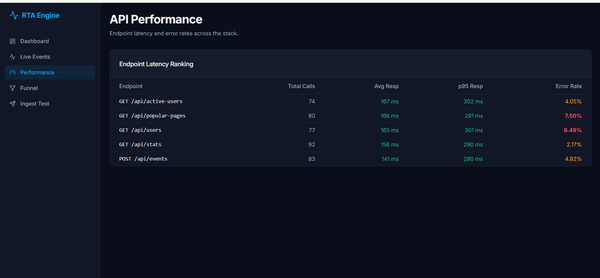
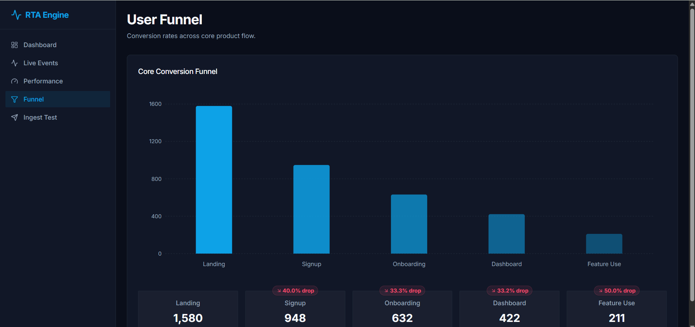
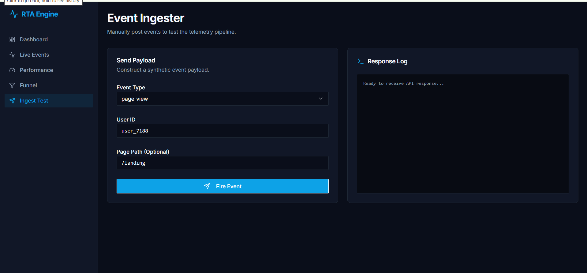
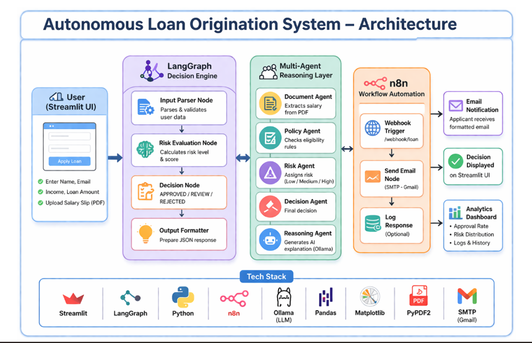

# 📊 RTA Engine — Real-Time Analytics Engine

A production-grade analytics platform for monitoring user sessions, traffic, API performance, errors, and feature adoption with live telemetry and real-time dashboards.

---

## 🚀 Live Demo

🌐 **Dashboard:** https://rta-engine-analytics-dashboard.vercel.app/

🔗 **Backend API:** https://rta-engine-api.onrender.com

---

## 🚀 Overview

RTA Engine is a full-stack real-time analytics platform designed to collect, process, and visualize application telemetry data. Built with a TypeScript-first architecture, it enables developers to monitor user behavior, analyze system performance, track feature adoption, and gain actionable insights through interactive dashboards.

The platform leverages real-time event streaming and WebSocket-powered updates to provide instant visibility into application health and usage patterns.

---

## 🧠 Key Features

📡 **Real-Time Event Tracking**  
Capture and stream application events with minimal latency.

👤 **Session Analytics**  
Track active users, session duration, and user journeys.

📈 **Traffic Monitoring**  
Analyze page views, requests, and user activity.

⚡ **API Performance Metrics**  
Monitor API latency, throughput, and response times.

🐞 **Error Monitoring**  
Detect and analyze runtime errors with contextual data.

🎯 **Feature Adoption Analytics**  
Measure feature usage and engagement.

🔍 **Funnel Analysis**  
Visualize user conversion paths and drop-off points.

🌊 **Live Event Stream**  
Observe analytics events as they occur.

🚨 **Smart Alerts**  
Trigger notifications when thresholds are exceeded.

📊 **Interactive Dashboard**  
Explore analytics through dynamic visualizations.

---

## 📸 Screenshots

### 📊 Dashboard

<p align="center">
  
</p>

### 🌊 Live Events

<p align="center">
  
</p>

### ⚡ API Performance

<p align="center">
  
</p>

### 🔍 User Funnel

<p align="center">
  
</p>

### 📡 Event Ingestor

<p align="center">
  
</p>

---

## 🏗️ Architecture

<p align="center">
  
</p>

---

## ⚙️ Workflow

```text
User Interaction
        ↓
Frontend (React + Vite)
        ↓
Event Collection API
(Node.js + Express)
        ↓
Validation Layer (Zod)
        ↓
Analytics Processing Engine
        ↓
Neon PostgreSQL + Drizzle ORM
        ↓
WebSocket Broadcasting
        ↓
Real-Time Dashboard
        ↓
Insights & Alerts
```

---

## 🛠️ Tech Stack

| Category | Technologies |
|----------|-------------|
| 🎨 Frontend | React, TypeScript, Vite, Tailwind CSS, Framer Motion |
| ⚙️ Backend | Node.js, Express.js |
| 🗄️ Database | Neon PostgreSQL, Drizzle ORM |
| 🛡️ Validation | Zod |
| 🔄 Data Fetching | TanStack Query |
| ⚡ Real-Time | WebSockets |
| ☁️ Deployment | Vercel, Render |

---

## 📂 Repository Structure

```bash
rta-engine/
│
├── artifacts/
├── lib/
│   ├── db/
│   ├── api-zod/
│   ├── api-client-react/
│   └── integrations/
│
├── scripts/
└── package.json
```

---

## 📡 API Endpoints

### Create Event

```http
POST /api/events
```

### Fetch Analytics

```http
GET /api/analytics
```

### Retrieve Sessions

```http
GET /api/sessions
```

---

## 🚀 Run Locally

```bash
git clone https://github.com/vyshnavi-0512/rta-engine.git

cd rta-engine

pnpm install

pnpm dev
```

---

## 🔒 Security Features

🛡️ Schema Validation using Zod

🔐 Environment Variable Protection

🔍 Type-safe APIs

⚙️ Strict TypeScript Configuration

---

## 📈 Metrics Tracked

📊 Active Users

⏱️ Session Duration

⚡ API Latency

🐞 Error Rate

📡 Event Volume

🎯 Feature Usage

---

## 🛣️ Future Improvements

🔲 Session Replay

🔲 AI Anomaly Detection

🔲 Heatmaps

🔲 Advanced Alerting

🔲 User Journey Tracking

🔲 Exportable Reports

---

## 👩‍💻 Author

**Vyshnavi Madishetti**

🔗 GitHub: https://github.com/vyshnavi-0512

---

⭐ If you found this project useful, consider giving it a star on GitHub!